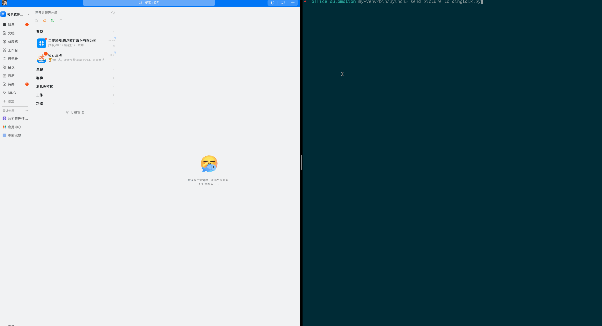

# 办公自动化工具集

这是一个用于办公自动化的Python工具集，主要用于处理Excel文件、生成图片并通过钉钉自动发送。


## 项目概述

本项目包含三个主要的Python脚本，用于实现从Excel数据处理到钉钉消息发送的完整自动化流程：

1. **gen_target_xlsx_file.py** - Excel文件生成器
2. **xlsx_to_img.py** - Excel转图片工具
3. **send_picture_to_dingtalk.py** - 钉钉图片自动发送工具

## 项目结构

```
office_automation/
├── gen_target_xlsx_file.py      # Excel文件生成脚本
├── xlsx_to_img.py               # Excel转图片脚本
├── send_picture_to_dingtalk.py  # 钉钉发送脚本
├── 人员名单.xlsx                 # 人员名单源文件
├── 卡号清单.xlsx                 # 卡号清单模板文件
├── xlsx/                        # 生成的Excel文件目录
│   ├── 张三.xlsx
│   ├── 李四.xlsx
│   └── 王五.xlsx
└── picture/                     # 生成的图片文件目录
    ├── 张三.png
    ├── 李四.png
    └── 王五.png
```

## 功能详解

### 1. gen_target_xlsx_file.py - Excel文件生成器

**功能**：根据人员名单批量生成个人专属的Excel文件

**主要特性**：
- 从`人员名单.xlsx`读取姓名列表
- 以`卡号清单.xlsx`为模板，为每个人员生成独立的Excel文件
- 将姓名自动填入指定单元格（L8）
- 生成的文件保存在`xlsx/`目录下

**使用方法**：
```bash
python gen_target_xlsx_file.py
```

**前置条件**：
- 确保`人员名单.xlsx`存在且包含"姓名"列
- 确保`卡号清单.xlsx`模板文件存在
- 确保`xlsx/`目录存在

### 2. xlsx_to_img.py - Excel转图片工具

**功能**：将Excel文件的指定区域转换为PNG图片

**主要特性**：
- 批量处理`xlsx/`目录下的所有Excel文件
- 截取指定单元格区域（第8-44行，第11-20列）
- 生成同名的PNG图片文件
- 图片保存在`picture/`目录下

**使用方法**：
```bash
python xlsx_to_img.py
```

**技术依赖**：
- 使用Spire.XLS库进行Excel处理
- 支持.xlsx和.xls格式

### 3. send_picture_to_dingtalk.py - 钉钉自动发送工具

**功能**：自动通过钉钉发送图片给指定联系人

**主要特性**：
- 自动化钉钉操作（搜索联系人、发送图片）
- 批量发送`picture/`目录下的所有图片
- 根据图片文件名确定接收人
- 支持macOS系统的钉钉客户端

**使用方法**：
```bash
python send_picture_to_dingtalk.py
```

**重要说明**：
- 需要手动调整坐标位置以适配您的屏幕分辨率
- 运行前需要打开钉钉客户端
- 脚本会在5秒后开始执行，请确保钉钉窗口在前台

## 安装依赖

```bash
# 安装基础依赖
pip install pandas openpyxl

# 安装Excel转图片依赖
pip install spire.xls

# 安装自动化操作依赖
pip install pyautogui pyperclip
```

## 完整使用流程

1. **准备数据文件**
   - 准备`人员名单.xlsx`，确保包含"姓名"列
   - 准备`卡号清单.xlsx`作为模板文件

2. **生成个人Excel文件**
   ```bash
   python gen_target_xlsx_file.py
   ```

3. **转换为图片**
   ```bash
   python xlsx_to_img.py
   ```

4. **发送到钉钉**
   ```bash
   python send_picture_to_dingtalk.py
   ```

## 注意事项

### 系统要求
- Python 3.6+
- MacOS系统（钉钉发送功能）
- 钉钉客户端

### 重要配置
- **坐标调整**：`send_picture_to_dingtalk.py`中的坐标需要根据您的屏幕分辨率调整
- **单元格范围**：`xlsx_to_img.py`中的截图范围可根据需要修改
- **目标单元格**：`gen_target_xlsx_file.py`中的目标单元格（L8）可根据模板调整

### 安全提醒
- 脚本会自动操作鼠标和键盘，运行时请勿进行其他操作
- 建议在测试环境中先验证坐标位置的准确性
- 发送间隔设置为10秒，可根据需要调整

## 故障排除

### 常见问题

1. **文件未找到错误**
   - 检查Excel文件是否存在
   - 确保文件路径正确

2. **坐标点击不准确**
   - 使用屏幕截图工具获取准确坐标
   - 根据屏幕分辨率调整坐标值

3. **Excel转图片失败**
   - 确保安装了正确版本的spire.xls
   - 检查Excel文件是否损坏

4. **钉钉发送失败**
   - 确保钉钉客户端已登录
   - 检查联系人姓名是否正确
   - 验证图片文件是否存在

## 许可证

本项目仅供学习和内部使用，请遵守相关软件的使用协议。

## 贡献

欢迎提交Issue和Pull Request来改进这个项目。

---

**免责声明**：本工具涉及自动化操作，使用前请确保符合您所在组织的IT政策和相关法规要求。
